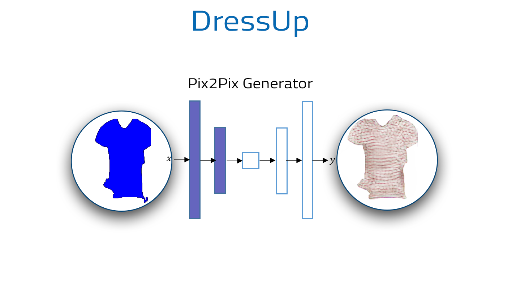
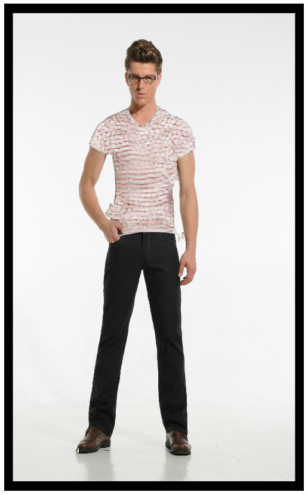
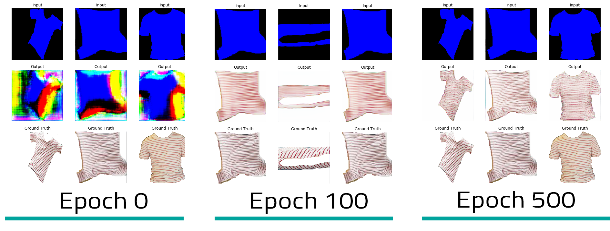

# DressUp
  

Proyecto desarrollado para participar en el "Reto DotCSV"


## Overview

DressUp es un algoritmo el cual tiene el fin de vestir a una persona con otro tipo de prenda.  Este consta de 2 arquitecturas de redes neuronales profundas.  

* Unet (modelo de segmentación)
* Pix2Pix 


La segmentación generada por nuestra primera Unet es coloreada de acuerdo a la prenda que queremos sustituir. 


```ruby
clothes_to_change={'playera_gris/playera_blanca': (255, 0, 0),
                    'playera_negra/playera_azul': (0, 255, 0),
                    'playera_rayas': (0, 0, 255),
                    'pantalon_negro': (0, 255, 255),
                    'sudadera_azul': (255, 255, 0),
                    'playera_tigre': (255, 0, 255)}            
```

En este caso seleccionamos el color azul, el cual corresponde a _"playera_rayas"_. Esta imagen es suministrada a la Unet-generadora para producir la prenda que reemplazaremos.


<p align="center">

</p>


El output final es el siguiente:
<p align="center">

</p>

El algoritmo cuenta soportada 6 prendas hasta el momento:
<p align="center">

</p>


## Getting Started

* Para poder contar con los pesos correspondientes es necesario descargarlos [aquí](https://mega.nz/#!kBonCSoa!4AbdnOmgY5Pfk4IhivdD4o6TiVHWomClOwABEsSB_X8), posterior a esto se descomprime el archivo dentro de la carpeta _data_ del repositorio

* [DressUp_Demo.ipynb](notebooks/DressUp_Demo.ipynb)  Es la forma más fácil de comenzar. Muestra un ejemplo del uso de un modelo previamente entrenado para segmentar prendas y reemplazarlas en sus propias imágenes.
Incluye código para ejecutar la detección de estas y su reemplazo.

* [Pix2Pix_Model_Training.ipynb](notebooks/Pix2Pix/Pix2Pix_Model_Training) Muestra cómo se entrenó a Dress Up. Este cuaderno presenta el  conjunto de datos usado, cual puede ser reemplazado por otra prenda.


## Training

<p align="center">

</p>

## Data

Para el entrenamiento de la primera arquitectura se optó por utilizar un dataset con una gran variedad de imagenes  _Clothing Co-Parsing _ (https://github.com/bearpaw/clothing-co-parsing) y para el caso del segundo modelo era necesario contar con un imágenes de una misma prenda  para ello fue de gran ayuda  _LookBook dataset_ (https://dgyoo.github.io), el cual cuenta con diversas fotografias de una misma prenda, la desventaja de este dataset es que no cuenta con imágenes etiquetadas.

## Considerations
*El modelo de segmentación fue entrenado con imágenes que contaban con diversas características: una sola persona mirando de frente de cuerpo completo, si se desea un desempeño óptimo  con estas consideraciones.

*Para un resultado más realista es necesario mayor número de imágenes y por ende mayor etiquetado.

## Reference
* _Clothing Co-Parsing_ (https://github.com/bearpaw/clothing-co-parsing)
* _LookBook dataset_ (https://dgyoo.github.io)
* _Applications of GANS_ https://medium.com/@jonathan_hui/gan-some-cool-applications-of-gans-4c9ecca35900


Nota: Para más detalles aqui [DressUp.pdf](docs/DressUp.pdf)
