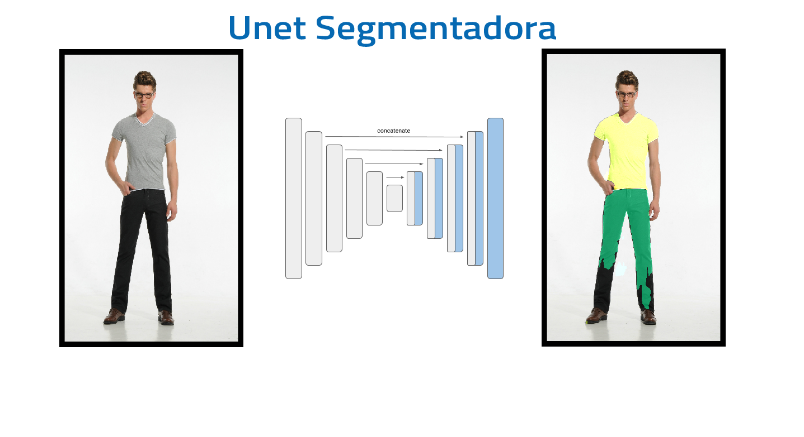
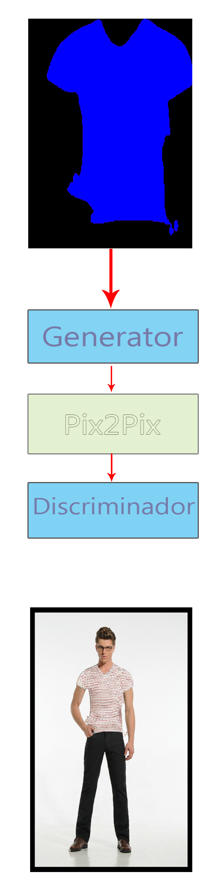

# DressUp
  

Proyecto desarrollado para participar en el "Reto DotCSV"


## Overview

DressUp es un algoritmo el cual tiene el fin de vestir a una persona con otro tipo de prenda.  Este consta de 2 arquitecturas de redes neuronales profundas.  

* Unet (modelo de segmentación)
* Pix2Pix 



La segmentación generada por nuestra primera Unet es coloreada de acuerdo a la prenda que queremos sustituir. 


```Ruby
clothes_to_change={'playera_gris/playera_blanca': (255, 0, 0),
                    'playera_negra/playera_azul': (0, 255, 0),
                    'playera_rayas': (0, 0, 255),
                    'pantalon_negro': (0, 255, 255),
                    'sudadera_azul': (255, 255, 0),
                    'playera_tigre': (255, 0, 255)}            
```

En este caso seleccionamos el color azul, el cual corresponde a _"playera_rayas"_. Esta imagen es suministrada a la Unet-generadora para generar la imagen que reemplazaremos.


El output final es el siguiente:

<p align="center">

</p>

Existen al rededor de 6 prendas soportadas
